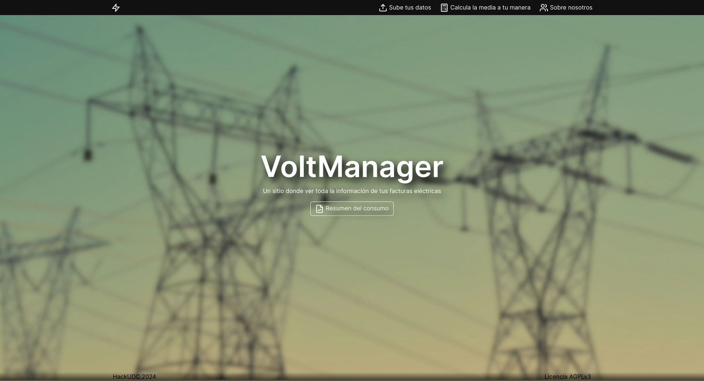

# VoltManager
> Volt manager es una herramienta web que te permite realizar un análisis exaustivo de tu consumo eléctrico. ¡Sube en CSV los datos de tu contador y visualiza cuándo y cómo gastas tu energía!

Nuestra entrega a HackUDC 2024

# Proyecto por:

- Pablo Fernández
- Adrián Freijeiro
- Xoel García
- Antón Liñares

# Liccencia
Proyecto licenciado bajo la AGPL 3.0.
Licencia completa en [LICENSE](LICENSE)
